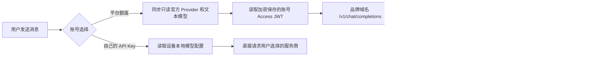

# OmniBot AI 请求双路由

主聊天现在会根据账号中的 AI 使用方式选择请求出口。



## 两种模式的安全边界

- 只有明确选择“OmniBot 官方 AI”渠道时才发送账号 Access JWT。选择 BYOK 渠道时，用户设备上的第三方地址、API Key、自定义请求头、协议与 wire API 均保持原样。
- BYOK 模式继续使用原有的设备本地模型配置，API Key 不上传账号服务器。
- Flutter 界面只能读取 `mode`、`ready` 和错误原因，拿不到账号 Token、BYOK Key 或内部 New API 地址。
- Access JWT 过期并收到 HTTP 401 时，主聊天会刷新登录会话并且只重试一次。
- 官方模型列表也只用账号 Access JWT 请求品牌网关；列表 401 同样只刷新并重试一次。
- “OmniBot 官方 AI”是运行时生成的只读 Provider，不写入本地 Provider 配置，也不覆盖或删除用户原来的 BYOK Key。

## 构建配置

`develop` 调试版本和 `production` 正式版本均默认使用两个公开的 HTTPS 地址：

```properties
OMNIBOT_BASE_URL=https://account.omnimind.com.cn
OMNIBOT_AI_GATEWAY_URL=https://model-api.omnimind.com.cn
```

打包时仍可通过同名构建属性覆盖默认值，以便连接其他部署环境。

- `OMNIBOT_BASE_URL` 用于注册、登录和账号设置。
- `OMNIBOT_AI_GATEWAY_URL` 是客户端可见的品牌网关前缀。主聊天会在其后请求 `/v1/chat/completions`。
- 不要把 New API 的内网 IP、管理后台地址、普通 Token 或上游模型 Key 写入 App 构建配置。

服务器反向代理应只把品牌路径转发到内网 New API，例如外部的
`https://model-api.omnimind.com.cn/v1/chat/completions` 转发成 New API 的 `/v1/chat/completions`。

任何手机需要访问的公网网址都可以被手机所有者观察到，因此品牌网关域名本身无法保密；真正需要隐藏、并且当前设计隐藏的是 New API 的内网地址、管理界面和全部上游密钥。

## 官方渠道的零配置流程

1. 登录后读取账号的 AI 模式。
2. 登录后，自动追加只读的“OmniBot 官方 AI”渠道，不替换已有 BYOK Provider 或场景绑定。
3. 用用户 JWT 请求品牌网关的 `/v1/models`，只保留主文本可用模型。
4. 首次使用选择已经验证的 `Qwen3.5-Plus`；用户之后可以在官方列表内覆盖主文本场景模型。
5. 保存主文本场景绑定后即可聊天，请求仍由品牌网关鉴权和扣额。

如果官方列表里没有已验证的默认模型，App 会明确显示“官方服务当前没有可用的文本模型”，不会静默选择一个未经验证的模型。

## 当前范围

主聊天文本、图片理解、图片生成和语音播放均按所选 Provider/场景绑定路由。选择官方渠道时只使用品牌网关和账号 Token，并按官方模型目录声明的文本、视觉、图片、TTS 能力工作；选择 BYOK 时保留设备端 Provider、Key、自定义 Header、协议、wire API 与场景绑定。两类凭据不会混用，登录、同步目录或退出账号也不会覆盖本地 BYOK 配置。
