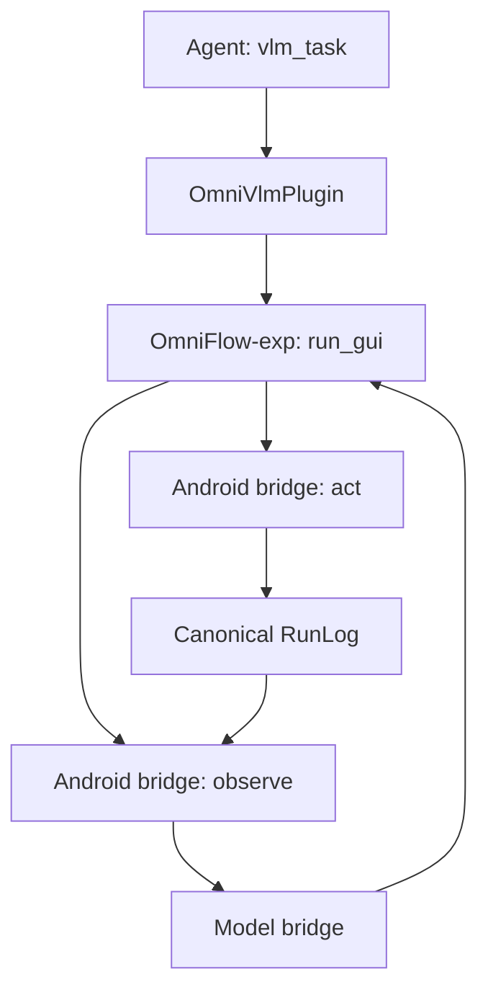

# Online VLM Android Core

`omniflow-android` is the Android bridge for the plugin-installed OmniFlow-exp
GUI harness. It owns Android observation/action, model transport, execution
controls, and RunLog persistence. It does not contain a second VLM planner.

## Execution path



The Android bridge owns:

- one `run_id` and one active GUI execution;
- the execution overlay, stop handling, and progress callbacks;
- model request transport and provider usage collection;
- native screenshot, XML, and canonical Action execution;
- canonical RunLog persistence with the five required truth fields.

The OmniFlow-exp `run_gui` harness exclusively owns durable decision policy:
default and task-specific prompting, Function recall routing, replay fallback,
UI projection, model-visible tools, validation, grounding, popup handling,
retries, completion, auto-registration intent, and per-turn output budget.
Kotlin callers may pass temporary guidance, but must not define another
permanent policy.

After the harness returns, Android first seals the canonical RunLog and then
executes only allowlisted `post_run_actions`. This keeps policy hot-updatable
without letting Python bypass host persistence or safety controls.

`androidgui` remains the only device I/O layer. It captures the current state
and executes canonical Actions. The Online VLM runtime does not add a second
tap, swipe, text-input, or app-launch implementation.

## Install semantics

The APK contains the Android GUI base. Installing the GUI plugin registers
`vlm_task` and prepares the pinned OmniFlow-exp and canonical OmniTransfer
runtime bundle. Enable/disable controls whether the tool is contributed to
Agent sessions. Runtime updates are delivered by updating the pinned plugin
bundle version and verified source checksums.

## Coordinate boundary

Canonical Actions and RunLogs store coordinates in `0..1000`. The VLM always
sees and returns raw pixels in the current original device display frame. XML
bounds use that same frame, even when the transported screenshot is compressed.

The OmniFlow-exp harness is the only Online VLM conversion owner:

- recent canonical action context is converted to raw pixels before every model
  call;
- model tool arguments are range-checked against the current display and then
  converted to canonical coordinates;
- conversion is unconditional, including raw values numerically below `1000`;
- a missing or invalid display fails instead of guessing.

## Model contract

Each turn requires exactly one native function tool call. Tool definitions come
from the canonical Action schema, use `tool_choice=required`, and disable
parallel calls. Unknown tools, fields, invalid JSON types, enum values, and
coordinate ranges fail validation before device execution.

The unified harness gives the model:

- the user goal and optional task-specific guidance;
- current package, activity, original display dimensions, screenshot, and XML;
- installed app labels/package names;
- recent action results converted to the current raw-pixel frame.

Action tools execute on the device. Decision tools finish, request user input,
or abort. Each executed action writes one canonical RunLog step; optional
`summary`, `thinking`, and token usage stay inside step `metadata`.

## Verification

```bash
./gradlew --no-daemon :omniflow-android:testDebugUnitTest
./gradlew --no-daemon :app:testDevelopStandardDebugUnitTest
cd ui && flutter test test/features/home/pages/plugin_market/plugin_market_page_test.dart
```

Device acceptance must additionally exercise Online VLM execution and RunLog
persistence on an Android device or emulator. Function enhancement and replay
remain separate OmniFlow workflows that share the same canonical actions.
